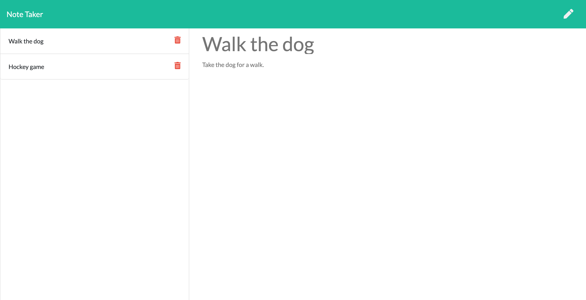

# Note Taker 

  ## **Table of Contents**
  1. [license](#license)
  2. [Description](#description)
  3. [Installation Instructions](#installation-instructions)
  4. [Usage information](#usage-information)
  5. [Contribution Guidelines](#contribution-guidelines)
  6. [Test Instructions](#test-instructions)
  7. [Questions?](#questions)

  ## **License:** 
 

  This application is covered under license type: MIT

  ## **Description:** 
 The following application allows the user to input a note with a corresponding title. Each note is assigned a unique id to allow POST and DELETE. The user can save each note which will display on the screen and can be selected again so the user can view the details of the note. Once the note is no longer needed or has been completed, the user can delete the note. This application can be accessed on Heroku at : https://limitless-stream-30170.herokuapp.com/.

 

  ## **Installation Instructions:**
 N/A 

  ## **Usage Information:** 
This application is deployed through Heroku.  

  ## **Contribution Guidelines:**
 N/A 

  ## **Test Instructions:** 
N/A

  ## **Questions:**

  Github Profile: [Rjpotere](https://github.com/Rjpotere).

  Contact me by email with additional questions: [Ryan.potere@gmail.com](mailto:Ryan.potere@gmail.com)

